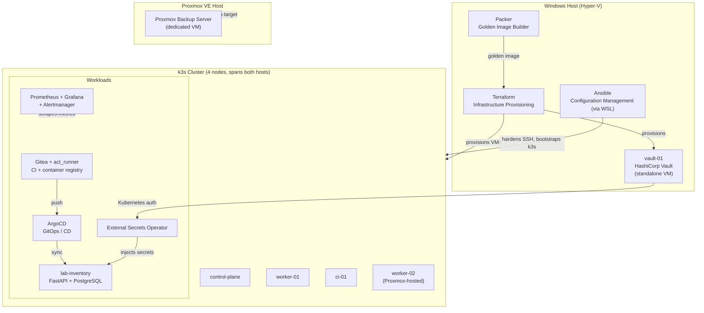

# DevOps Lab

An end-to-end infrastructure project built to demonstrate practical DevOps
skills: Infrastructure as Code, configuration management, container
orchestration, CI/CD, GitOps, observability, secrets management and backups —
entirely self-hosted on local hardware.

## Architecture



## Tech Stack & Rationale

| Layer | Tool | Why |
| --- | --- | --- |
| Image building | Packer | Bakes one hygienic Ubuntu golden image (autoinstall, cloud-init cleaned, host keys stripped) so every VM starts from the same known-good state |
| Provisioning | Terraform | Clones the golden image into differencing disks and creates Hyper-V VMs declaratively; state-driven and reproducible |
| Configuration | Ansible | SSH hardening (key-only auth, no root login) and k3s bootstrap, driven from a WSL control node |
| Orchestration | k3s | Lightweight Kubernetes — full core functionality at a fraction of the footprint of `kubeadm`, appropriate at this scale |
| CI | Gitea + act_runner | Self-hosted git server with GitHub-Actions-compatible workflow syntax; the runner executes jobs via Docker-in-Docker inside the cluster |
| Registry | Gitea container registry | Images stay inside the lab; no external registry account or rate limits |
| CD / GitOps | ArgoCD | Reconciles cluster state to match git; no manual `kubectl apply` for deployed apps |
| Observability | kube-prometheus-stack | Prometheus, Grafana, Alertmanager, node-exporter and kube-state-metrics for cluster-wide visibility |
| Secrets | HashiCorp Vault + External Secrets Operator | Central secret storage with short-lived Kubernetes auth instead of secrets committed to git |
| Backups | Proxmox Backup Server | Deduplicated, incremental backups on a dedicated VM with write-only access |

## Infrastructure Layout

Two physical machines, one logical cluster:

- **Windows host (Hyper-V)** — `control-plane`, `worker-01`, `ci-01`, and
  `vault-01` (standalone, deliberately outside the cluster it serves).
- **Proxmox VE host** — `worker-02`, joined to the same cluster over the LAN,
  plus a dedicated Proxmox Backup Server VM.

Running the cluster across two hypervisors was intentional: it forces every
assumption about node-local storage, image pulls and networking to be made
explicit rather than accidentally working because everything sat on one host.

## Secrets Pipeline

Secrets are never committed to git and never typed into manifests.

1. Vault runs on a standalone VM with a KV v2 engine.
2. The cluster authenticates to Vault using the **Kubernetes auth method** —
   Vault verifies a pod's ServiceAccount token via the API server's
   TokenReview endpoint, so no static credential is stored anywhere.
3. A Vault policy grants read access to exactly one secret path, and a role
   binds that policy to a single ServiceAccount in a single namespace.
4. **External Secrets Operator** reads that path and materialises a native
   Kubernetes `Secret`, refreshing it on a schedule.

The application only ever sees ordinary environment variables. Rotating a
password in Vault propagates without touching the manifests.

## Backups

Proxmox Backup Server runs as a dedicated VM with its own datastore.

The access model is the interesting part: the hypervisor authenticates with an
**API token**, not an account password, and that token holds the
`DatastoreBackup` role only. It can write new backups but cannot prune or
delete existing ones. A compromised host therefore cannot destroy its own
backup history — the common failure mode in ransomware incidents.

SSH password authentication is disabled on every node. On Ubuntu this required
removing `/etc/ssh/sshd_config.d/50-cloud-init.conf`, which is loaded *before*
the main config and silently re-enables password login.

## Lab Inventory

A small internal application that documents the lab itself — and doubles as a
full path from source to running workload, exercising every layer of the stack:

- **Database** — PostgreSQL as a StatefulSet, credentials delivered by the
  secrets pipeline above, schema applied from versioned SQL migrations.
- **API** — FastAPI with a connection pool, running as a non-root container.
- **UI** — server-rendered Jinja2 pages for listing, adding and editing records.
- **CI** — a Gitea Actions workflow builds the image and pushes it to the
  in-cluster registry on every commit.
- **CD** — ArgoCD deploys from the same repository.

The schema covers hosts, virtual machines, services and their exposure. The
next stage is a collector that populates it automatically from the Proxmox API
and the Kubernetes API instead of by hand.

## Self-Hosted Services

**Immich** — photo backup. Uploads live on an SMB share mounted from the
Windows host onto a worker node and exposed to the cluster as a `hostPath`
PersistentVolume with node affinity. The database and ML model cache use fast
local storage instead, since network storage is a poor fit for database I/O.
The resource-heavy machine-learning component is pinned to a separate node via
`nodeSelector`, keeping it off the node serving the database and API.

**Nextcloud** — file storage, backed by MariaDB and the same share. Uncovered a
subtle requirement of the official image: it expects the *entire*
`/var/www/html` directory on one persistent volume, because it manages upgrades
and internal file layout itself. Splitting `config` and `data` onto separate
PVCs — a reasonable-looking optimisation — broke its own install detection and
caused a crash loop. Consolidating to a single PVC resolved it.

**Vaultwarden** — Bitwarden-compatible password manager, deliberately kept on
local-path storage rather than the SMB share, avoiding the permission issues
hit with Nextcloud's data directory.

External access to these three goes through a VPS reverse proxy over a
WireGuard tunnel, with Let's Encrypt certificates.

## Security Hardening

- Key-only SSH across all nodes; no root login.
- Reverse-proxy rate limiting on login endpoints, plus a fail2ban jail that
  reads the proxy access log and bans source IPs at the network level via
  `nftables`. Validated with a live brute-force test (Kali Linux, Hydra,
  `rockyou.txt`) — see `security/` for the secret-free configuration.
- Backup credentials scoped to write-only, as described above.
- Wazuh agents deployed via Ansible for host-level intrusion detection.

## Key Problems Solved

Built through hands-on debugging rather than a scripted happy path:

- **Packer boot on Generation 2 (UEFI) Hyper-V VMs** — a `boot_command`
  targeting the GRUB edit menu failed silently; entering the GRUB command line
  directly injects the `autoinstall` kernel parameter reliably.
- **Hyper-V KVP IP autodetection** — Packer's SSH communicator could not
  discover the guest IP over NAT/KVP; solved with a static IP via cloud-init.
- **Cloud-init seed ISO generation on Windows** — IMAPI2FS via `ADODB.Stream`
  broke under parallel Terraform execution; replaced with an `Add-Type` unsafe
  `IStream` implementation and serialised applies.
- **Terraform provider path normalisation** — the Hyper-V provider round-tripped
  disk paths with inconsistent slash direction, producing "inconsistent final
  plan" errors; fixed with an explicit `replace()`.
- **SSH hardening undone by cloud-init** — described under Backups above.
- **act_runner Docker socket race** — the runner started before the `dind`
  sidecar's daemon was ready, causing crash loops; solved with a
  register-or-daemon retry loop that never exits the container, avoiding
  Kubernetes' exponential backoff.
- **ArgoCD CRD size limit** — the `ApplicationSet` CRD exceeded the 262144-byte
  annotation limit on client-side apply; resolved with server-side apply.
- **Private registry over plain HTTP** — `docker buildx` ignored the
  insecure-registry configuration and failed on push; switching the workflow to
  plain `docker build`/`docker push`, and declaring the registry in
  `registries.yaml` on every node, fixed image pulls cluster-wide.
- **Stale image on redeploy** — restarting a Deployment before CI finished
  pulled the previous `latest`. A reminder that a mutable tag is not a release
  identifier.

## Repository Structure

```
ansible/            SSH hardening, k3s bootstrap, Wazuh agent playbooks
kubernetes/         Manifests for cluster workloads
packer/             Golden image definition (autoinstall + cloud-init)
terraform/cluster/  Hyper-V VM provisioning
security/           fail2ban jails and rate-limiting configuration
scripts/            Operational helper scripts
```

## Status

Infrastructure, CI, CD/GitOps, observability, secrets management and backups
are deployed and verified end-to-end across two hypervisors.

## Next Steps

- Automated collector to populate the inventory from the Proxmox and Kubernetes
  APIs.
- Velero for cluster-level backup and restore.
- Shared network storage, removing the node affinity that currently pins
  stateful workloads to one node.
- Network segmentation into VLANs.
- SSH certificate authentication issued by Vault.
- Cloud provider practice (AWS / Azure) alongside the existing Oracle footprint.
