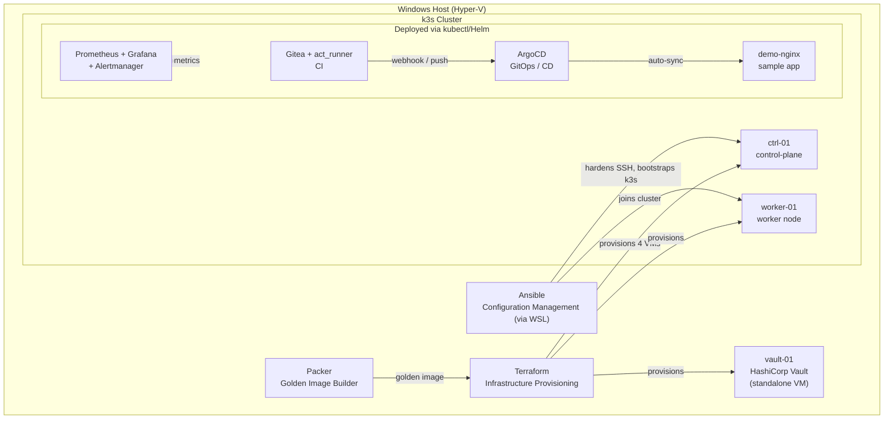

# DevOps Home Lab

An end-to-end home infrastructure project built to demonstrate practical DevOps skills: Infrastructure as Code, configuration management, container orchestration, CI/CD, GitOps, observability, and secrets management — all self-hosted on local hardware.

## Architecture

## Tech Stack & Rationale

| Layer | Tool | Why |
|---|---|---|
| Image building | Packer | Bakes a single, hygienic Ubuntu 22.04 golden image (autoinstall, cloud-init cleaned, host keys stripped) so every VM starts from the same known-good state |
| Provisioning | Terraform | Clones the golden image into differencing disks and creates 4 Hyper-V VMs declaratively; state-driven, fully reproducible |
| Configuration | Ansible | SSH hardening (key-only auth, no root login) and k3s cluster bootstrap, driven from a WSL control node |
| Orchestration | k3s | Lightweight Kubernetes distribution — full core functionality with a fraction of the footprint of full `kubeadm`, appropriate for a home-lab scale cluster |
| CI | Gitea + act_runner | Self-hosted git server with GitHub-Actions-compatible workflow syntax; the runner executes jobs via Docker-in-Docker inside the cluster |
| CD / GitOps | ArgoCD | Watches a git repository and automatically reconciles cluster state to match it (auto-sync + self-heal); no manual `kubectl apply` for deployed apps |
| Observability | kube-prometheus-stack | Prometheus for metrics, Grafana for dashboards, Alertmanager for alerting, node-exporter/kube-state-metrics for cluster-wide visibility |
| Secrets | HashiCorp Vault | Centralized secret storage instead of hardcoding tokens/passwords in config files or git |

## Infrastructure Layout

- **Host 1 (Windows + Hyper-V)**: `ctrl-01` (192.168.50.210), `worker-01` (.211), `ci-01` (.212, reserved for future use), `vault-01` (.213)
- **Host 2 (Proxmox)**: planned second worker node, joining the same cluster over the LAN

## Key Problems Solved

This project was built through hands-on debugging, not a scripted happy path. Some of the harder issues encountered and resolved:

- **Packer boot on Generation 2 (UEFI) Hyper-V VMs**: initial `boot_command` targeting the GRUB edit menu silently failed; switched to entering the GRUB command line directly to inject the `autoinstall` kernel parameter reliably.
- **Hyper-V KVP-based IP autodetection**: Packer's SSH communicator couldn't discover the guest IP over NAT/KVP; resolved by assigning a static IP via cloud-init and pointing Packer directly at it.
- **Cloud-init NoCloud seed generation on Windows**: building the seed ISO with IMAPI2FS via `ADODB.Stream` was unreliable and broke under parallel Terraform execution; replaced with a robust `Add-Type`/unsafe `IStream` read implementation and serialized the apply (`-parallelism=1`).
- **Terraform/provider path normalization bug**: the Hyper-V provider round-tripped disk paths with inconsistent slash direction, causing "inconsistent final plan" errors; fixed with an explicit `replace()` in the resource definition.
- **SSH hardening undone by cloud-init**: Ubuntu's `sshd_config` `Include` directive loads `/etc/ssh/sshd_config.d/50-cloud-init.conf` *before* the main config, so cloud-init's `PasswordAuthentication yes` silently overrode the hardening playbook; fixed by removing the override file before applying the hardened setting.
- **act_runner Docker socket race condition**: the runner container started before the sidecar `dind` container's Docker daemon was ready, causing crash loops; solved with a self-contained retry loop (register-or-daemon) that never exits the container, avoiding Kubernetes' exponential backoff.
- **ArgoCD CRD size limit**: the `ApplicationSet` CRD's `kubectl apply` annotation exceeded Kubernetes' 262144-byte limit; resolved using `--server-side --force-conflicts` apply instead of client-side apply.

## Repository Structure

## Status

Core infrastructure, CI, CD/GitOps, observability, and secrets management are all deployed and verified end-to-end. Planned next steps: second worker node on Proxmox, SSH certificate-based authentication via Vault, and cloud provider practice (AWS/Azure).
